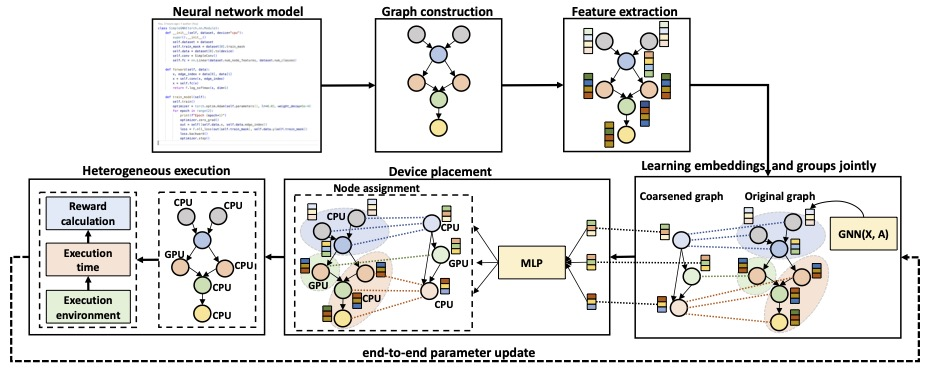

<div align=center>
<h1>A Structure-Aware Framework for Learning Device Placements on Computation Graphs</h1>


 [](https://arxiv.org/abs/2405.14185)
 [](https://hits.seeyoufarm.com)

<div>
      <a href="https://scholar.google.com/citations?user=8AxaJXoAAAAJ&hl=en" target="_blank">Shukai Duan</a><sup>1*</sup>,
      <a href="https://cps.usc.edu/studs.html" target="_blank">Heng Ping</a><sup>1*</sup>,
      <a href="https://scholar.google.com/citations?user=rX-SfF8AAAAJ&hl=en" target="_blank">Nikos Kanakaris</a><sup>1*</sup>,
      <a href="https://scholar.google.com/citations?user=AvIxA64AAAAJ&hl=en" target="_blank">Xiongye Xiao</a><sup>1*</sup>,
      <a href="https://scholar.google.com/citations?user=6b8N2RQAAAAJ&hl=en" target="_blank">Panagiotis Kyriakis</a><sup>2*</sup>,
      <a href="https://scholar.google.com/citations?user=AFV0nLcAAAAJ&hl=en" target="_blank">Nesreen K. Ahmed</a><sup>3</sup>,
      <a href="https://cps.usc.edu/studs.html" target="_blank">Peiyu Zhang</a><sup>1</sup>,
      <a href="https://scholar.google.com/citations?user=2K81fLYAAAAJ&hl=en" target="_blank">Guixiang Ma</a><sup>4</sup>,
      <a href="https://scholar.google.com/citations?user=C0X-LkgAAAAJ&hl=en&oi=ao" target="_blank">Mihai Capota</a><sup>4</sup>,
      <a href="https://scholar.google.com/citations?user=22r6J9IAAAAJ&hl=en" target="_blank">Shahin Nazarian</a><sup>1</sup>,
      <a href="https://scholar.google.com/citations?user=l0SYN0EAAAAJ&hl=en" target="_blank">Theodore L. Willke</a><sup>4</sup>,
      <a href="https://scholar.google.com/citations?user=Xw_v8-gAAAAJ&hl=en" target="_blank">Paul Bogdan</a><sup>1</sup>
    <div>
    <sup>1</sup>University of Southern California, <sup>2</sup>Meta, <sup>3</sup>Cisco Outshift, <sup>4</sup>Intel Labs
    </div>
</div>
</div>

---

This repository is the official implementation of the paper "A Structure-Aware Framework for Learning Device Placements on Computation Graphs" accepted at the NeurIPS 2024 conference.

## Overview


* Proposes a novel framework for device placement, using smaller computation graphs extracted from the OpenVINO toolkit and reinforcement learning.
* Consists of five steps, including graph coarsening, node representation learning, and policy optimization.
* Supports end-to-end training and considers the directed and acyclic nature of the computation graphs.
* A model variant inspired by graph parsing networks and complex network analysis, enabling joint graph representation learning and personalized graph partitioning.


## Setup
* Code is written in Python 3.9
* Set up the conda environment with following command: `conda env create -f environment.yml`

## Instructions

To use the **RNN baseline**:
1. Open `RNN_bert.ipynb` and `RNN_resnet_inceptionv3.ipynb` in a **jupyter** notebook.
2. Edit the input data shape specified by your model to match your XML file.
3. Run all cells in each notebook. 


To use the **Placeto baseline**:
1. Unzip **PlacetoOpenVINO.zip** under your directory and update the location of your XML file and the appropriate input.
2. To run the code, install and use our **TensorFlow** and **OpenVINO Conda environment** by executing `conda env create -f environment_tf.yml`.


To run our approach, HSDAG:
1. Provide the location of your XML file in config.py.
2. Run the **main.py** script with the appropriate input parameters for your experiment.


Notes:
1. Our source code for Placeto is modified based on https://github.com/mmitropolitsky/device-placement.
2. In HSDAG, we use the [Graph Parsing Network](https://arxiv.org/pdf/2402.14393). Visit the repository to check out their license.


## Blogs

* [USC Viterbi school](https://viterbischool.usc.edu/news/2024/12/usc-at-the-conference-on-neural-information-processing-systems-neurips-2024/)
* [Intel labs](https://community.intel.com/t5/Blogs/Tech-Innovation/Artificial-Intelligence-AI/Intel-Presents-Novel-AI-Research-at-NeurIPS-2024/post/1648522)
* [Cisco outshift](https://outshift.cisco.com/blog/leadership-in-ai-research-9-papers-accepted-neurips)
* [Papers with codee](https://paperswithcode.com/paper/a-structure-aware-framework-for-learning)

## Bibliography

Please cite our paper if you use this code:

```bibtex
@misc{duan2024structureawareframeworklearningdevice,
      title={A structure-aware framework for learning device placements on computation graphs}, 
      author={Shukai Duan and Heng Ping and Nikos Kanakaris and Xiongye Xiao and Peiyu Zhang and Panagiotis Kyriakis and Nesreen K. Ahmed and Guixiang Ma and Mihai Capota and Shahin Nazarian and Theodore L. Willke and Paul Bogdan},
      year={2024},
      eprint={2405.14185},
      archivePrefix={arXiv},
      primaryClass={cs.LG},
      url={https://arxiv.org/abs/2405.14185}, 
}
```